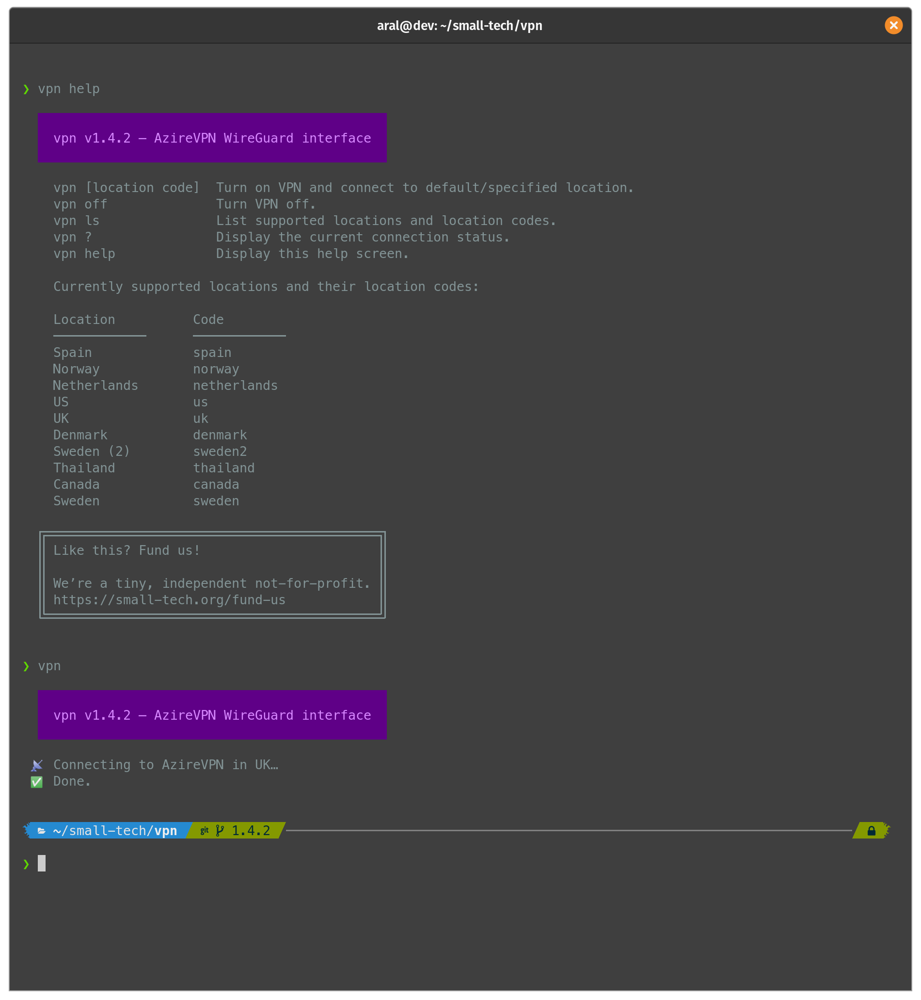

# vpn

An elegant command-line interface for AzireVPN’s Wireguard service.



## Install

Copy and paste the following command into your terminal. Before you pipe any script into your computer, always [view the source code](https://source.small-tech.org/aral/vpn/-/raw/master/install) and make sure you understand what it does.

```sh
wget -qO- https://source.small-tech.org/aral/vpn/-/raw/master/install?inline=false | bash
```

__Note:__ installations are carried out from [our own canonical source code repository](https://source.small-tech.org/aral/vpn/), not from this mirror as GitHub caches responses. This repository is used for issues and pull requests.

## Use

### Connect to the default server

```sh
▶ vpn
```

Sample output:

```
 📡 Connecting to AzireVPN in UK…
 ✅ Done.
```

### Connect to a specific server

```sh
▶ vpn netherlands
```

Sample output:

```
 👋 Disconnecting existing connection…
 📡 Connecting to AzireVPN in Netherlands…
 ✅ Done.
```

### Get list of currently supported servers

```sh
▶ vpn ls
```

Sample output:

```
Location      Code
────────────  ────────────
Spain         spain
Norway        norway
Netherlands   netherlands
US            us
UK            uk
Denmark       denmark
Sweden (2)    sweden2
Thailand      thailand
Canada        canada
Sweden        sweden
```

### Disconnect

```sh
▶ vpn off
```

Sample output:

```
 👋 Disconnecting from AzireVPN in Netherlands…
 ✅ Done.
```

(You can also use the aliases `down` and `disconnect` if you prefer.)

### Get connection status

```sh
▶ vpn ?
```

Sample output:

```
 ❌ You are not connected to AzireVPN via Wireguard.
```

What I really want to do is to write a little status bar app for it that automatically connects on untrusted networks and does so to the nearest server by default but this should tide me over till then.

Hope you enjoy it!

## Like this? Fund us!

[Small Technology Foundation](https://small-tech.org) is a tiny, independent not-for-profit.

We exist in part thanks to patronage by people like you. If you share [our vision](https://small-tech.org/about/#small-technology) and want to support our work, please [become a patron or donate to us](https://small-tech.org/fund-us) today and help us continue to exist.

## Copyright

&copy; 2020 [Aral Balkan](https://ar.al), [Small Technology Foundation](https://small-tech.org).

## License

[AGPL version 3.0 or later.](https://www.gnu.org/licenses/agpl-3.0.en.html)
